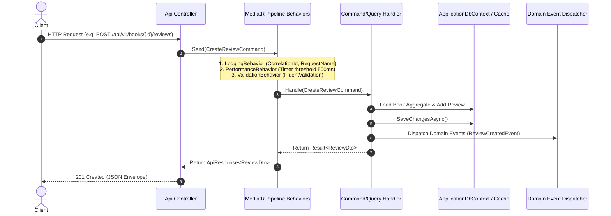
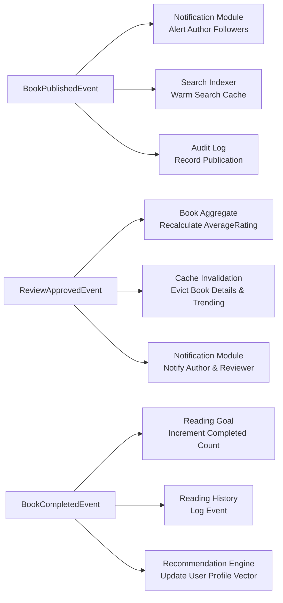

# BookVerse — Architecture Design Document

## 1. Architectural Vision & Principles

**BookVerse** is an enterprise-grade platform for discovering, managing, reading, reviewing, and recommending books and novels. The backend is designed according to **Clean Architecture** and **Domain-Driven Design (DDD)** principles, complemented by the **Command Query Responsibility Segregation (CQRS)** pattern.

### Core Architectural Principles
- **Separation of Concerns:** Business rules are strictly encapsulated in the Domain layer and are entirely independent of UI, databases, frameworks, and transport protocols.
- **Dependency Inversion:** Outer layers (Infrastructure, API) depend on inner abstractions (Domain, Application). Inner layers never depend on outer layers.
- **Single Responsibility & CQRS:** Write operations (Commands) mutate state and trigger domain events; Read operations (Queries) project optimized read-models without side effects.
- **Explicit Invariants & Encapsulation:** Entities protect their own internal state. Constructors and domain methods enforce domain invariants.
- **Resilient & Observable:** Built-in structured logging, correlation tracking, centralized exception handling (RFC 7807), and graceful degradations (e.g. cache fallback).

---

## 2. Project Structure & Dependency Graph

```
                   ┌─────────────────────────────────┐
                   │          BookVerse.Api          │
                   │  (Presentation & Web Hosting)   │
                   └───────┬─────────────────┬───────┘
                           │                 │
                           ▼                 │
        ┌──────────────────────────────────┐ │
        │      BookVerse.Infrastructure    │ │
        │  (EF Core, Redis, Jobs, Auth)   │ │
        └──────────────┬───────────────────┘ │
                       │                     │
                       ▼                     ▼
        ┌────────────────────────────────────────────┐
        │          BookVerse.Application             │
        │   (CQRS Features, Pipelines, Contracts)    │
        └──────────────────────┬─────────────────────┘
                               │
                               ▼
        ┌────────────────────────────────────────────┐
        │             BookVerse.Domain               │
        │  (Entities, Value Objects, Domain Events)  │
        └────────────────────────────────────────────┘
```

### Layer Responsibilities

| Layer | Project | Responsibilities | Dependencies |
|---|---|---|---|
| **Domain** | `BookVerse.Domain` | Enterprise entities, aggregate roots, value objects, domain events, domain exceptions, core business logic, and repository contracts. | None (Pure C# 13/14) |
| **Application** | `BookVerse.Application` | CQRS Commands & Queries, MediatR Pipeline Behaviors, FluentValidation rules, Application DTOs, Event Handlers, Interfaces. | `BookVerse.Domain`, MediatR, FluentValidation, Mapster |
| **Infrastructure** | `BookVerse.Infrastructure` | EF Core 10 `ApplicationDbContext`, SQL Server entity configurations, Redis cache implementation, background jobs, JWT generator, full-text search engine. | `BookVerse.Application`, EF Core, StackExchange.Redis |
| **Presentation** | `BookVerse.Api` | ASP.NET Core controllers, routing (`/api/v1/...`), authentication & authorization filters, OpenAPI / Swagger specs, Serilog configuration, health checks. | `BookVerse.Application`, `BookVerse.Infrastructure` |

---

## 3. Modular Boundaries

The system is organized into high-cohesion domain modules inside the solution:

1. **Identity Module:** Registration, authentication, token refresh rotation, revocation, role-based and permission-based authorization, user sessions.
2. **User Profile Module:** User metadata, avatars, reading preferences, reading goals.
3. **Books Module:** Canonical works, publication lifecycle (`Draft`, `Published`, `Archived`), and physical/digital `BookEdition` variants (Hardcover, Paperback, Ebook, Audiobook).
4. **Authors Module:** Author profiles, biography, social presence, multi-author contributions (`Author`, `CoAuthor`, `Translator`, `Editor`), author following.
5. **Genres & Tags Module:** Hierarchical tree-structured genres (`ParentGenreId`), dynamic tagging catalog.
6. **Library Module:** Personal bookshelves (`WantToRead`, `Reading`, `Completed`, `Paused`, `Dropped`), book favoriting.
7. **Reading Tracking Module:** Exact page progress, calculated percentage, reading history timeline, annual reading goals.
8. **Reviews & Moderation Module:** 1–5 star ratings, textual reviews, anti-abuse rate limits & profanity moderation, atomic rating aggregates.
9. **Search Module:** Full-text indexing, multi-criteria filtering, weighted relevance ranking.
10. **Recommendations Module:** Deterministic multi-signal scoring, similarity matrix, time-decay trending books.
11. **Notifications Module:** In-app real-time & persistent notification pipeline.
12. **Analytics & Audit Module:** User reading metrics, monthly trends, administrative dashboards, immutable audit logging.

---

## 4. CQRS & MediatR Pipeline Architecture

All application interactions route through a robust MediatR processing pipeline:



### Pipeline Behaviors
- **`LoggingBehavior<TRequest, TResponse>`:** Emits structured logs before and after execution, attaching Correlation ID, User ID, and Execution Duration.
- **`ValidationBehavior<TRequest, TResponse>`:** Inspects all registered `IValidator<TRequest>`, executing rules in parallel and throwing `ValidationException` on violations.
- **`PerformanceBehavior<TRequest, TResponse>`:** Flags any query or command that exceeds 500 milliseconds with high-priority performance warning logs.
- **`TransactionBehavior<TRequest, TResponse>`:** Encloses write operations in an atomic database transaction where necessary and coordinates domain event dispatching post-commit.

---

## 5. Event-Driven Decoupling

BookVerse employs in-process Domain Events to decouple cross-module workflows. When state changes occur within an Aggregate Root:



---

## 6. Concurrency & Data Integrity Strategy

1. **Optimistic Concurrency Control:**
   - Entities prone to concurrent updates (`Book`, `ReadingProgress`, `BookReview`) contain a `byte[] RowVersion` column mapped as EF Core concurrency tokens.
   - If two updates collide, EF Core throws `DbUpdateConcurrencyException`, translated by the API into a structured `HTTP 409 Conflict` response with instructions for client state reconciliation.
2. **Atomic Aggregation:**
   - Book rating aggregates (`AverageRating`, `RatingsCount`, `ReviewsCount`) are updated within domain methods when a review is published or updated, avoiding expensive table scans on high-traffic book pages.
3. **Idempotent Operations:**
   - Library status transitions and author following operations use unique constraints (`UserId` + `BookId`, `UserId` + `AuthorId`) to prevent race-condition duplications.
