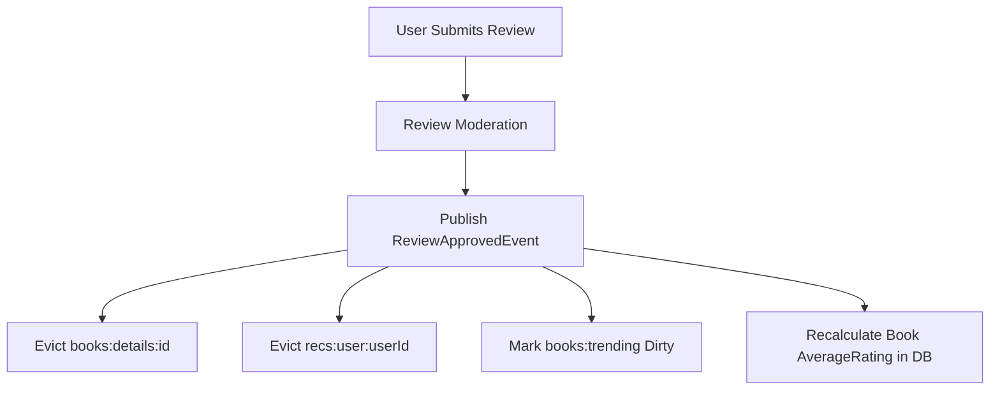

# BookVerse — Redis Caching Strategy

## 1. Caching Principles & Architecture

BookVerse integrates **Redis 7** via `StackExchange.Redis` through a resilient abstraction (`ICacheService`).
Caching is applied selectively to read-heavy, latency-sensitive endpoints, while maintaining strict cache invalidation rules to prevent stale data.

### Resilient Fallback Pattern
If Redis becomes temporarily unreachable (e.g. network partition or cold start):
1. The caching service catches connection exceptions.
2. A structured warning is logged.
3. Execution silently falls back to the database.
4. User requests never fail due to cache unavailability.

---

## 2. Keyspaces, TTLs & Eviction Policies

| Keyspace | Key Pattern | TTL | Invalidation Trigger |
|---|---|---|---|
| **Trending Books** | `books:trending` | 5 minutes | Periodic background job or manual admin eviction. |
| **User Recommendations** | `recs:user:{userId}` | 15 minutes | Invalidated on `BookCompletedEvent` or `ReviewCreatedEvent`. |
| **Popular Genres** | `genres:taxonomy` | 1 hour | Invalidated when a new genre is created or modified. |
| **Book Details** | `books:details:{id}` | 30 minutes | Invalidated on `BookUpdatedEvent` or `ReviewApprovedEvent`. |
| **Author Profiles** | `authors:details:{id}` | 1 hour | Invalidated on `AuthorUpdatedEvent` or `BookPublishedEvent`. |

---

## 3. Cache Invalidation Flow

