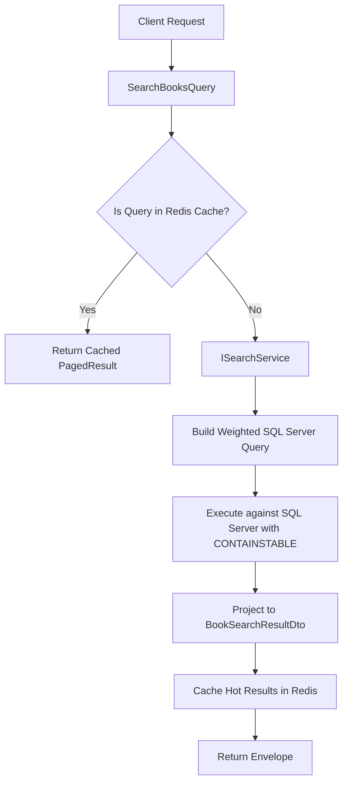

# BookVerse — Search Architecture

## 1. Overview

Search is a core discovery pillar in BookVerse. The architecture is engineered to provide fast, relevant search across millions of books, authors, genres, and user tags, using **Microsoft SQL Server Full-Text Search (FTS)** combined with structured SQL Server indexed filters and multi-criteria relevance scoring.

---

## 2. Query Architecture & Endpoints

### Endpoint
```http
GET /api/v1/books/search?q={query}&genre={genre}&tag={tag}&author={author}&minRating={minRating}&language={lang}&yearFrom={yearFrom}&yearTo={yearTo}&sortBy={sortBy}&page=1&pageSize=20
```

### Flow Diagram


---

## 3. Weighted Relevance Scoring Formula

When a user submits a text query $q$, the ranking score $S(B)$ for book $B$ is computed as:

$$S(B) = \left( w_1 \cdot M_{\text{title}} + w_2 \cdot M_{\text{prefix}} + w_3 \cdot M_{\text{author}} + w_4 \cdot M_{\text{tags}} + w_5 \cdot M_{\text{desc}} \right) \times Q(B)$$

### Weight Coefficients
- $w_1 = 100$ : Exact Title Match (`Title = q`)
- $w_2 = 50$  : Title Prefix / Substring Match (`Title LIKE 'q%'` or FTS term match)
- $w_3 = 35$  : Author Name Match (`Author.Name LIKE '%q%'`)
- $w_4 = 25$  : Genre or Tag Match (`Genre.Name = q` OR `Tag.Name = q`)
- $w_5 = 10$  : Description Full-Text Match (`FREETEXT(Description, q)`)

### Quality Multiplier $Q(B)$
To prevent low-quality or unreviewed books with identical titles from outranking established titles, the score is scaled by a bounded logarithmic quality factor:

$$Q(B) = 1.0 + 0.1 \times \log_{10}(\text{RatingsCount} + 1) \times \left( \frac{\text{AverageRating}}{5.0} \right)$$

---

## 4. Indexing & SQL Server Full-Text Catalog

1. **Full-Text Catalog:** `BookVerse_FTCatalog`
   - Indexed Columns: `Books.Title` (Weight: 1.0), `Books.Subtitle` (Weight: 0.6), `Books.Description` (Weight: 0.2), `Authors.Name` (Weight: 0.8).
2. **Relational Covering Indexes:**
   - `IX_Books_Search_Covering`: Filtered index on `(Status, AverageRating, PublicationDate)` INCLUDE `(Id, Title, PageCount, CoverImageUrl)`.
   - `IX_BookAuthors_AuthorId_BookId`: Index supporting rapid join between author name and books.
   - `IX_BookTags_TagId_BookId`: Index supporting tag-based search filters.
3. **Paging & Execution Safety:**
   - Strict `AsNoTracking()` on all search queries.
   - Projections (`Select(...)`) only retrieve display fields needed for `BookSearchResultDto`.
   - Server-side pagination via `OFFSET / FETCH NEXT`. Never executes `.ToList()` before filtering.
