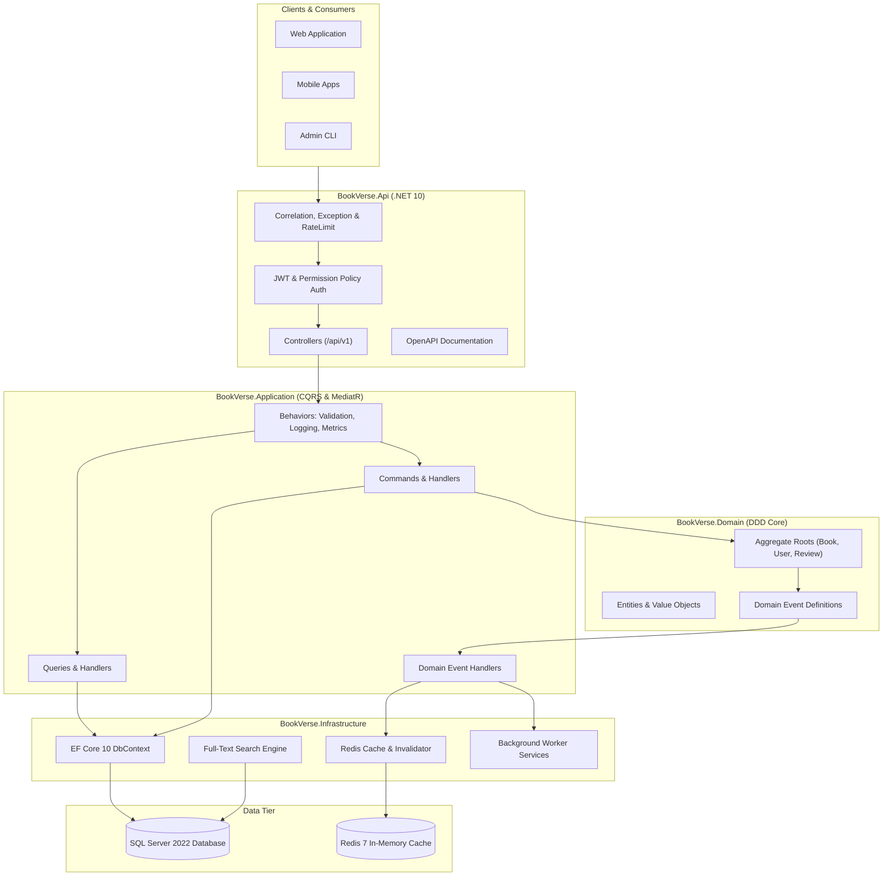

# 1. System Architecture Diagram

```mermaid
graph TB
    subgraph Clients["Clients & Consumers"]
        Web["Web Application"]
        Mobile["Mobile Apps"]
        CLI["Admin CLI"]
    end

    subgraph API_Layer["BookVerse.Api (.NET 10)"]
        Controllers["Controllers (/api/v1)"]
        Middleware["Correlation, Exception & RateLimit"]
        AuthFilter["JWT & Permission Policy Auth"]
        Swagger["OpenAPI Documentation"]
    end

    subgraph App_Layer["BookVerse.Application (CQRS & MediatR)"]
        Pipelines["Behaviors: Validation, Logging, Metrics"]
        Commands["Commands & Handlers"]
        Queries["Queries & Handlers"]
        DomainEvents["Domain Event Handlers"]
    end

    subgraph Domain_Layer["BookVerse.Domain (DDD Core)"]
        Aggregates["Aggregate Roots (Book, User, Review)"]
        Entities["Entities & Value Objects"]
        Events["Domain Event Definitions"]
    end

    subgraph Infra_Layer["BookVerse.Infrastructure"]
        EF["EF Core 10 DbContext"]
        RedisClient["Redis Cache & Invalidator"]
        FTS["Full-Text Search Engine"]
        BackgroundJobs["Background Worker Services"]
    end

    subgraph Data_Storage["Data Tier"]
        SQL[("SQL Server 2022 Database")]
        Redis[("Redis 7 In-Memory Cache")]
    end

    Clients --> Middleware
    Middleware --> AuthFilter
    AuthFilter --> Controllers
    Controllers --> Pipelines
    Pipelines --> Commands
    Pipelines --> Queries
    Commands --> Aggregates
    Queries --> EF
    Commands --> EF
    Aggregates --> Events
    Events --> DomainEvents
    DomainEvents --> RedisClient
    DomainEvents --> BackgroundJobs
    EF --> SQL
    RedisClient --> Redis
    FTS --> SQL
```
