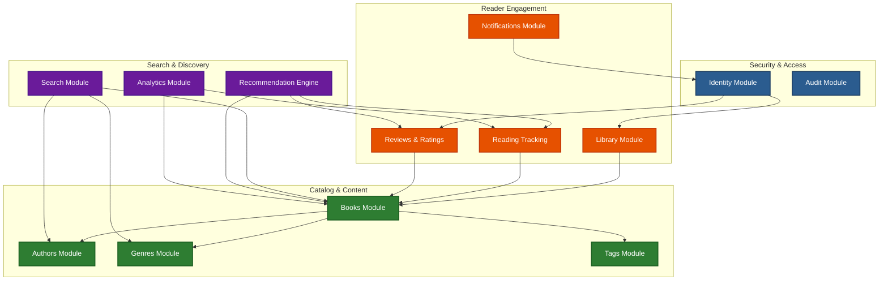

# 2. Module Architecture Diagram

```mermaid
graph TD
    classDef core fill:#2b5c8f,stroke:#1d3f63,stroke-width:2px,color:#fff;
    classDef catalog fill:#2e7d32,stroke:#1b5e20,stroke-width:2px,color:#fff;
    classDef user fill:#e65100,stroke:#bf360c,stroke-width:2px,color:#fff;
    classDef discovery fill:#6a1b9a,stroke:#4a148c,stroke-width:2px,color:#fff;

    subgraph Security["Security & Access"]
        Identity["Identity Module"]:::core
        Audit["Audit Module"]:::core
    end

    subgraph ContentCatalog["Catalog & Content"]
        Books["Books Module"]:::catalog
        Authors["Authors Module"]:::catalog
        Genres["Genres Module"]:::catalog
        Tags["Tags Module"]:::catalog
    end

    subgraph UserSpace["Reader Engagement"]
        Library["Library Module"]:::user
        Reading["Reading Tracking"]:::user
        Reviews["Reviews & Ratings"]:::user
        Notifications["Notifications Module"]:::user
    end

    subgraph DiscoveryEngine["Search & Discovery"]
        Search["Search Module"]:::discovery
        Recommendations["Recommendation Engine"]:::discovery
        Analytics["Analytics Module"]:::discovery
    end

    Identity --> Library
    Identity --> Reviews
    Books --> Authors
    Books --> Genres
    Books --> Tags
    Library --> Books
    Reading --> Books
    Reviews --> Books
    Search --> Books
    Search --> Authors
    Search --> Genres
    Recommendations --> Reading
    Recommendations --> Reviews
    Recommendations --> Books
    Notifications --> Identity
    Analytics --> Reading
    Analytics --> Books
```
