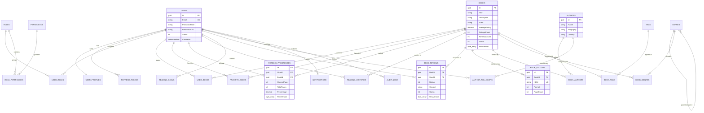

# 3. Database Entity Relationship Diagram (ERD)

```mermaid
erDiagram
    USERS ||--|| USER_PROFILES : "has"
    USERS ||--o{ REFRESH_TOKENS : "holds"
    USERS ||--o{ USER_ROLES : "assigned"
    ROLES ||--o{ USER_ROLES : "groups"
    ROLES ||--o{ ROLE_PERMISSIONS : "contains"
    PERMISSIONS ||--o{ ROLE_PERMISSIONS : "granted"

    USERS ||--o{ USER_BOOKS : "tracks"
    BOOKS ||--o{ USER_BOOKS : "saved in"

    USERS ||--o{ FAVORITE_BOOKS : "favorites"
    BOOKS ||--o{ FAVORITE_BOOKS : "favorited"

    USERS ||--o{ READING_PROGRESSES : "records"
    BOOKS ||--o{ READING_PROGRESSES : "tracked"

    USERS ||--o{ READING_HISTORIES : "generates"
    BOOKS ||--o{ READING_HISTORIES : "subject of"

    USERS ||--o{ READING_GOALS : "defines"

    USERS ||--o{ BOOK_REVIEWS : "writes"
    BOOKS ||--o{ BOOK_REVIEWS : "reviewed in"

    BOOKS ||--o{ BOOK_EDITIONS : "published as"
    BOOKS ||--o{ BOOK_AUTHORS : "written by"
    AUTHORS ||--o{ BOOK_AUTHORS : "writes"

    GENRES ||--o{ GENRES : "parent/subgenre"
    BOOKS ||--o{ BOOK_GENRES : "categorized in"
    GENRES ||--o{ BOOK_GENRES : "includes"

    BOOKS ||--o{ BOOK_TAGS : "tagged with"
    TAGS ||--o{ BOOK_TAGS : "applied to"

    USERS ||--o{ AUTHOR_FOLLOWERS : "follows"
    AUTHORS ||--o{ AUTHOR_FOLLOWERS : "followed by"

    USERS ||--o{ NOTIFICATIONS : "receives"
    USERS ||--o{ AUDIT_LOGS : "performs"

    USERS {
        guid Id PK
        string Email UK
        string PasswordHash
        string PasswordSalt
        int Status
        datetimeoffset CreatedAt
    }

    BOOKS {
        guid Id PK
        string Title
        string Description
        string ISBN
        decimal AverageRating
        int RatingsCount
        int ReviewsCount
        int Status
        byte_array RowVersion
    }

    BOOK_EDITIONS {
        guid Id PK
        guid BookId FK
        string ISBN UK
        int Format
        int PageCount
    }

    AUTHORS {
        guid Id PK
        string Name
        string Biography
        string Country
    }

    BOOK_REVIEWS {
        guid Id PK
        guid BookId FK
        guid UserId FK
        int Rating
        string Content
        int Status
        byte_array RowVersion
    }

    READING_PROGRESSES {
        guid Id PK
        guid UserId FK
        guid BookId FK
        int CurrentPage
        int TotalPages
        decimal Percentage
        byte_array RowVersion
    }
```
