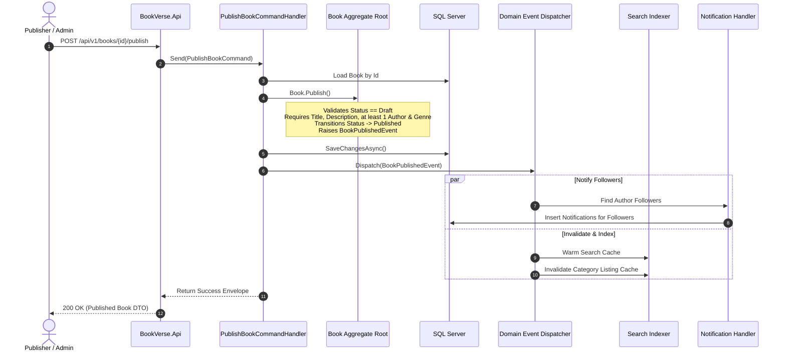

# 4. Book Publishing Lifecycle Flow

```mermaid
sequenceDiagram
    autonumber
    actor Admin as Publisher / Admin
    participant Api as BookVerse.Api
    participant Handler as PublishBookCommandHandler
    participant Book as Book Aggregate Root
    participant DB as SQL Server
    participant Events as Domain Event Dispatcher
    participant Search as Search Indexer
    participant Notif as Notification Handler

    Admin->>Api: POST /api/v1/books/{id}/publish
    Api->>Handler: Send(PublishBookCommand)
    Handler->>DB: Load Book by Id
    Handler->>Book: Book.Publish()
    Note over Book: Validates Status == Draft<br/>Requires Title, Description, at least 1 Author & Genre<br/>Transitions Status -> Published<br/>Raises BookPublishedEvent
    Handler->>DB: SaveChangesAsync()
    Handler->>Events: Dispatch(BookPublishedEvent)
    par Notify Followers
        Events->>Notif: Find Author Followers
        Notif->>DB: Insert Notifications for Followers
    and Invalidate & Index
        Events->>Search: Warm Search Cache
        Events->>Search: Invalidate Category Listing Cache
    end
    Handler-->>Api: Return Success Envelope
    Api-->>Admin: 200 OK (Published Book DTO)
```
