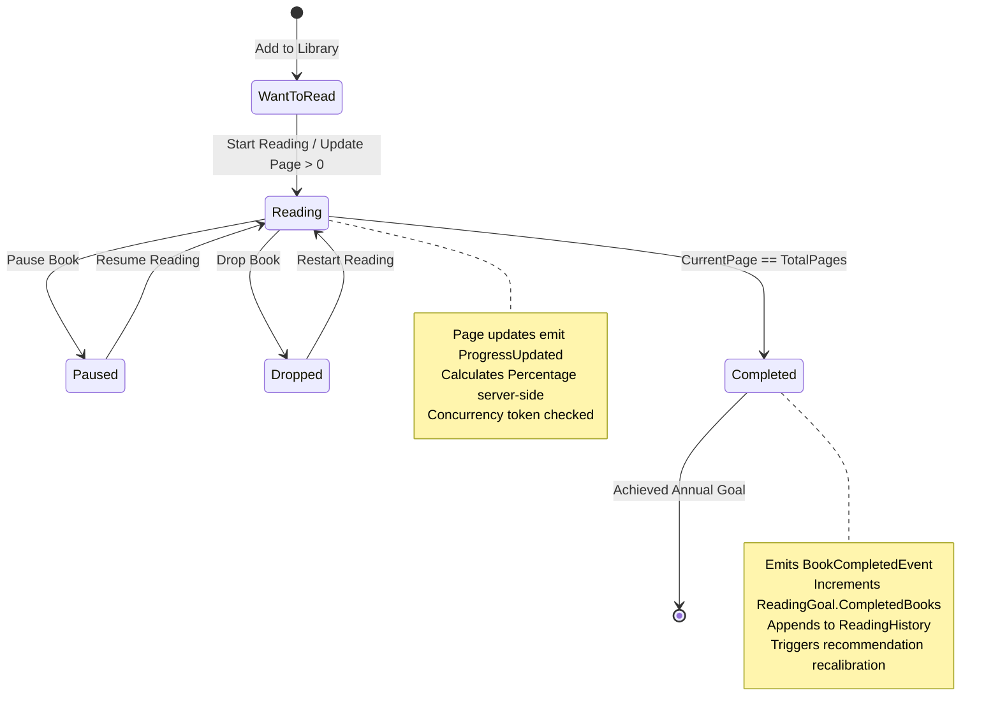

# 5. Reading Lifecycle State Machine

```mermaid
stateDiagram-v2
    [*] --> WantToRead : Add to Library
    WantToRead --> Reading : Start Reading / Update Page > 0
    Reading --> Paused : Pause Book
    Paused --> Reading : Resume Reading
    Reading --> Dropped : Drop Book
    Dropped --> Reading : Restart Reading
    Reading --> Completed : CurrentPage == TotalPages
    Completed --> [*] : Achieved Annual Goal

    note right of Reading
      Page updates emit ProgressUpdated
      Calculates Percentage server-side
      Concurrency token checked
    end note

    note right of Completed
      Emits BookCompletedEvent
      Increments ReadingGoal.CompletedBooks
      Appends to ReadingHistory
      Triggers recommendation recalibration
    end note
```
