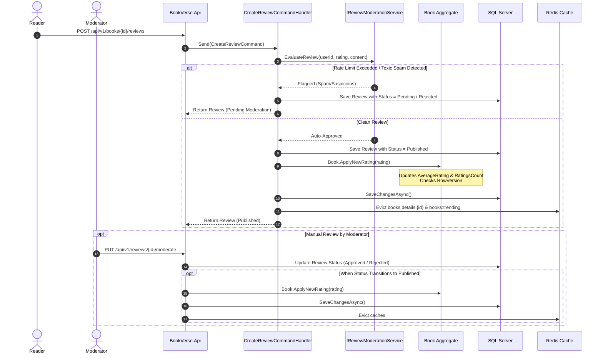

# 6. Review Moderation & Anti-Abuse Flow

```mermaid
sequenceDiagram
    autonumber
    actor Reader
    actor Moderator
    participant Api as BookVerse.Api
    participant Handler as CreateReviewCommandHandler
    participant AntiAbuse as IReviewModerationService
    participant Book as Book Aggregate
    participant DB as SQL Server
    participant Cache as Redis Cache

    Reader->>Api: POST /api/v1/books/{id}/reviews
    Api->>Handler: Send(CreateReviewCommand)
    Handler->>AntiAbuse: EvaluateReview(userId, rating, content)
    alt Rate Limit Exceeded / Toxic Spam Detected
        AntiAbuse-->>Handler: Flagged (Spam/Suspicious)
        Handler->>DB: Save Review with Status = Pending / Rejected
        Handler-->>Api: Return Review (Pending Moderation)
    else Clean Review
        AntiAbuse-->>Handler: Auto-Approved
        Handler->>DB: Save Review with Status = Published
        Handler->>Book: Book.ApplyNewRating(rating)
        Note over Book: Updates AverageRating & RatingsCount<br/>Checks RowVersion
        Handler->>DB: SaveChangesAsync()
        Handler->>Cache: Evict books:details:{id} & books:trending
        Handler-->>Api: Return Review (Published)
    end

    opt Manual Review by Moderator
        Moderator->>Api: PUT /api/v1/reviews/{id}/moderate
        Api->>DB: Update Review Status (Approved / Rejected)
        opt When Status Transitions to Published
            Api->>Book: Book.ApplyNewRating(rating)
            Api->>DB: SaveChangesAsync()
            Api->>Cache: Evict caches
        end
    end
```
