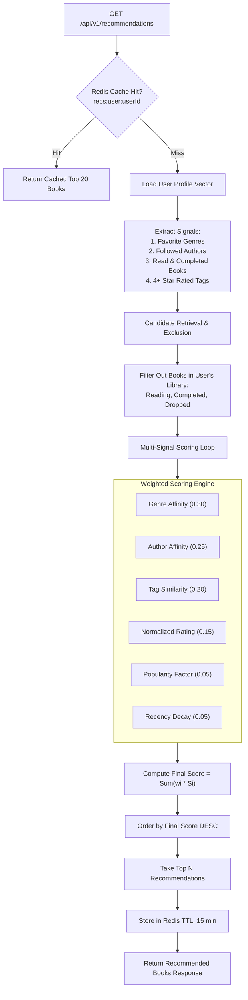

# 7. Recommendation Engine Pipeline Flow

```mermaid
flowchart TD
    Req[GET /api/v1/recommendations] --> CacheCheck{Redis Cache Hit?<br/>recs:user:userId}
    CacheCheck -- Hit --> ReturnCache[Return Cached Top 20 Books]

    CacheCheck -- Miss --> LoadProfile[Load User Profile Vector]
    LoadProfile --> UserSignals[Extract Signals:<br/>1. Favorite Genres<br/>2. Followed Authors<br/>3. Read & Completed Books<br/>4. 4+ Star Rated Tags]

    UserSignals --> CandidateFilter[Candidate Retrieval & Exclusion]
    CandidateFilter --> ExcludeExisting[Filter Out Books in User's Library:<br/>Reading, Completed, Dropped]

    ExcludeExisting --> ScoringLoop[Multi-Signal Scoring Loop]

    subgraph ScoringMatrix["Weighted Scoring Engine"]
        S1["Genre Affinity (0.30)"]
        S2["Author Affinity (0.25)"]
        S3["Tag Similarity (0.20)"]
        S4["Normalized Rating (0.15)"]
        S5["Popularity Factor (0.05)"]
        S6["Recency Decay (0.05)"]
    end

    ScoringLoop --> ScoringMatrix
    ScoringMatrix --> CompositeScore["Compute Final Score = Sum(wi * Si)"]

    CompositeScore --> RankTop[Order by Final Score DESC]
    RankTop --> LimitTop[Take Top N Recommendations]
    LimitTop --> CacheStore[Store in Redis TTL: 15 min]
    CacheStore --> Resp[Return Recommended Books Response]
```
