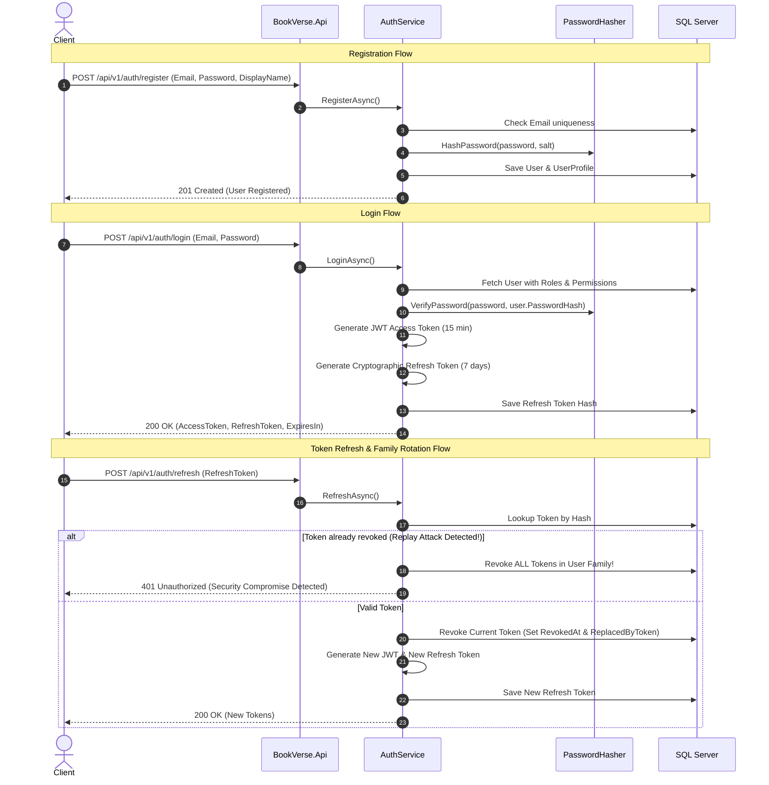

# 8. Authentication & Token Rotation Flow

```mermaid
sequenceDiagram
    autonumber
    actor Client
    participant Api as BookVerse.Api
    participant Auth as AuthService
    participant Hasher as PasswordHasher
    participant DB as SQL Server

    Note over Client, DB: Registration Flow
    Client->>Api: POST /api/v1/auth/register (Email, Password, DisplayName)
    Api->>Auth: RegisterAsync()
    Auth->>DB: Check Email uniqueness
    Auth->>Hasher: HashPassword(password, salt)
    Auth->>DB: Save User & UserProfile
    Auth-->>Client: 201 Created (User Registered)

    Note over Client, DB: Login Flow
    Client->>Api: POST /api/v1/auth/login (Email, Password)
    Api->>Auth: LoginAsync()
    Auth->>DB: Fetch User with Roles & Permissions
    Auth->>Hasher: VerifyPassword(password, user.PasswordHash)
    Auth->>Auth: Generate JWT Access Token (15 min)
    Auth->>Auth: Generate Cryptographic Refresh Token (7 days)
    Auth->>DB: Save Refresh Token Hash
    Auth-->>Client: 200 OK (AccessToken, RefreshToken, ExpiresIn)

    Note over Client, DB: Token Refresh & Family Rotation Flow
    Client->>Api: POST /api/v1/auth/refresh (RefreshToken)
    Api->>Auth: RefreshAsync()
    Auth->>DB: Lookup Token by Hash
    alt Token already revoked (Replay Attack Detected!)
        Auth->>DB: Revoke ALL Tokens in User Family!
        Auth-->>Client: 401 Unauthorized (Security Compromise Detected)
    else Valid Token
        Auth->>DB: Revoke Current Token (Set RevokedAt & ReplacedByToken)
        Auth->>Auth: Generate New JWT & New Refresh Token
        Auth->>DB: Save New Refresh Token
        Auth-->>Client: 200 OK (New Tokens)
    end
```
